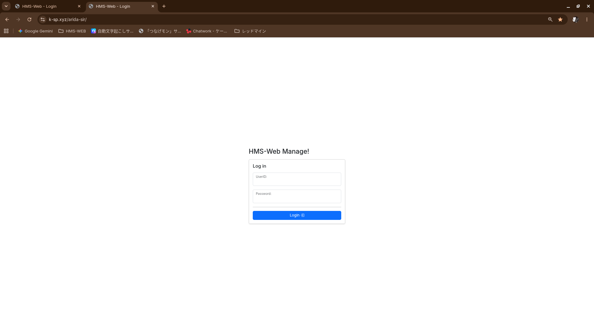
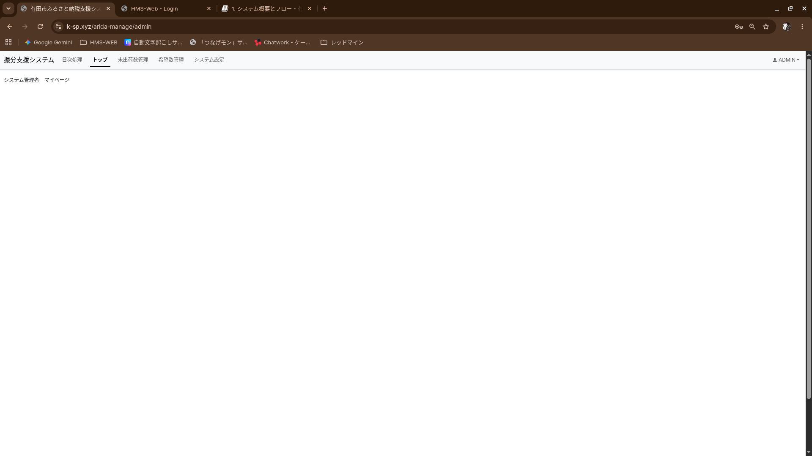
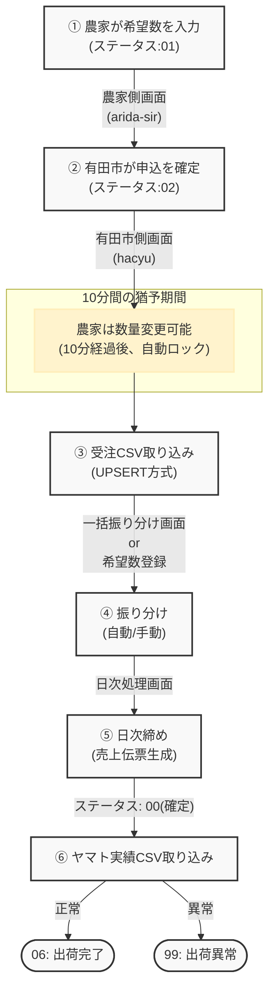
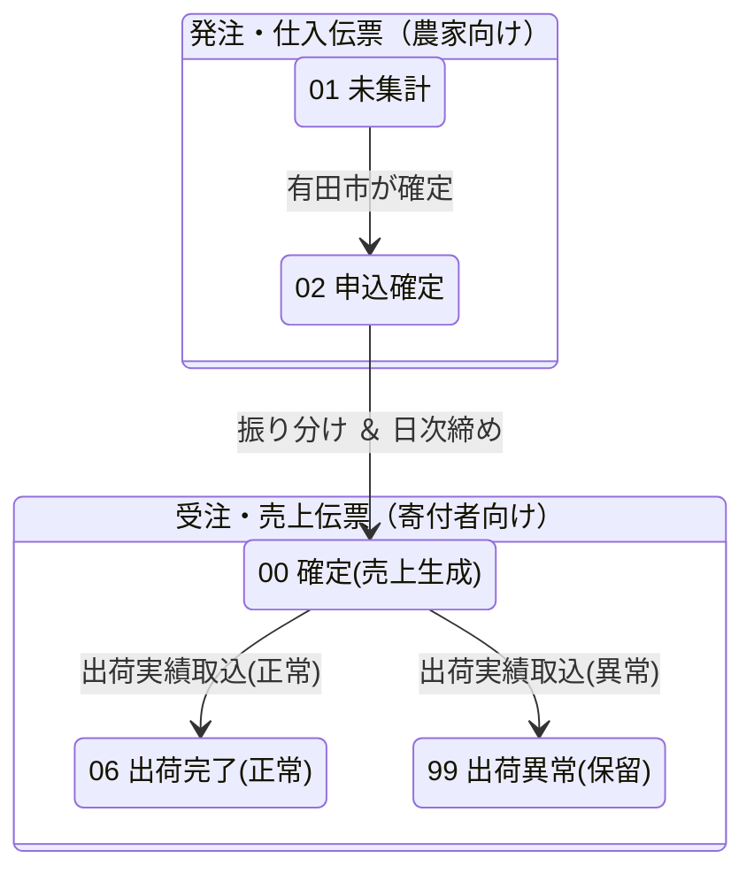

# 1. システム概要とフロー

> [!NOTE]
> **本書のステータス**: たたき台（ドラフト）  
> **対象読者**: 有田市ふるさと創生室 ご担当者様  
> **最終更新**: 2026-06-04  
> **作成**: ケーエスピー株式会社（KSP）

## 1.1 本システムの目的

有田市ふるさと納税における**返礼品の受発注から出荷までの一連の業務**を効率的に管理するためのシステムです。

## 1.2 主な機能

| 機能 | 概要 |
|:-----|:-----|
| 農家側 希望数入力 | 返礼品の供給希望数を登録・管理 |
| 有田市側 申込管理 | 農家からの申込を確認・確定 |
| 一括振り分け | 受注に対する返礼品の振り分け（自動/手動） |
| 受注CSV取り込み | 注文データの一括インポート（UPSERT方式） |
| 日次締め | 売上伝票の生成と確定 |
| 出荷実績取り込み | ヤマト運輸のCSVから出荷実績を反映 |
| 日次解除 | 締め処理のロールバック（やり直し） |

## 1.3 環境情報

| 項目 | 内容 |
|:-----|:-----|
| 本番URL | tsunage-mon.jp |
| 農家側画面 | arida-sir |
| 有田市側管理画面 | arida-manage |

> [!IMPORTANT]
> **⚠️ 重要**: 開発環境と本番環境は**Mirror（ミラー）構成**です。どちらのURLからアクセスしても**同じ本番データ**に反映されます。テスト用URLでの試し打ちは本番データに影響しますのでご注意ください。

---

# 2. ログインと画面構成

## 2.1 農家側画面（arida-sir）

<!-- TODO: 画像挿入 — ログイン画面のスクリーンショット -->

- 農家ごとにアカウントが発行されています
- ログイン後、 **案内板（一覧画面）** が表示されます

## 2.2 有田市側管理画面（arida-manage）

<!-- TODO: 画像挿入 — 管理画面トップのスクリーンショット -->

主な画面一覧：

| 画面名 | 用途 |
|:-------|:-----|
| 申込み登録（hacyu） | 農家からの希望数の確認・ステータス管理 |
| 一括振り分け（ihacj） | 受注に対する返礼品の割り当て |
| 受注取込（ijuc） | 受注CSVのインポート・結果確認 |
| 出荷実績取込 | ヤマトCSVのインポート・結果確認 |

---

# 3. 業務フロー全体像

## 3.1 フロー図

## 3.2 ステータスフロー概要

---

