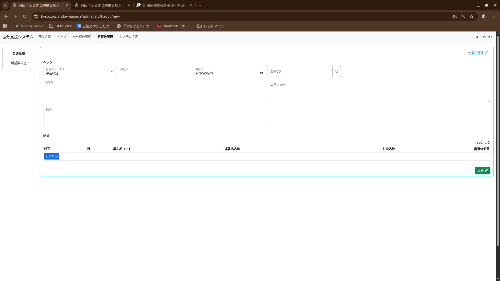
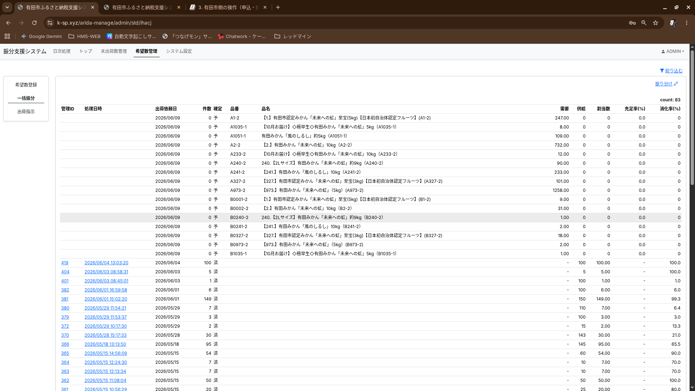

# 5. 有田市側の操作（申込管理）

## 5.1 申込一覧の確認

1. `arida-manage` にログイン
2. 「申込み登録」画面を開く
3. ステータスのプルダウンで絞り込み（デフォルト: `02:申込確定`）

<!-- TODO: 画像挿入 — 申込み登録画面（一覧） -->

## 5.2 ステータスの変更（確定・ロック解除）

| 操作 | 説明 |
|:-----|:-----|
| `01` → `02` に変更 | 農家の申込を**確定**する（10分タイマー開始） |
| `02` → `01` に戻す | 確定を**解除**し、農家が再編集できるようにする |

## 5.3 希望残数の確認

- 画面上に**希望残数**がリアルタイムで表示されます
- これは「希望数 − 確定済み分 − 仮押さえ分」を自動計算した値です
- マイナスにならないよう制御されています

---

# 6. 有田市側の操作（振り分け）

## 6.1 一括振り分け画面の見方

<!-- TODO: 画像挿入 — 一括振り分け画面 -->

### ステータス表示（4段階）

| 表示 | 意味 | 説明 |
|:----:|:-----|:-----|
| **【予】** | 予測 | 申込締切済みかつ、まだ振り分けされていない |
| **【未】** | 未処理 | 振り分け対象として認識されている |
| **【仮】** | 仮押さえ | 振り分け済みだが、日次締め前 |
| **【済】** | 確定済み | 日次締め完了 |

### 予測値について
- ふるさと納税doから取り込んだ受注と、申込を締め切った時点での申込数を参照しています。
- 受注のある返礼品の中で、自動振分を行った場合の予測値になります。参考値としてお使いください。
  - 同じ代表品番のものは共有していますので、ご注意ください。

<!-- 2026 06/18 
- | **【予】** | 予測 | 確定済みだが、まだ振り分けされていない |
+ | **【予】** | 予測 | 申込締切済みかつ、まだ振り分けされていない |

+ ### 予測値について
+ - ふるさと納税doから取り込んだ受注と、申込を締め切った時点での申込数を参照しています。
+ - 受注のある返礼品の中で、自動振分を行った場合の予測値になります。参考値としてお使いください。
+   - 同じ代表品番のものは共有していますので、ご注意ください。
-->

### 充足率について

- 確定済み（【済】）の行は、需要数と充足率が **`-`** でマスクされます
- これは過去の実績値との矛盾を防ぐための仕様です

## 6.2 自動振り分け

- 「自動振り分け」ボタンで、システムが最適な割り当てを自動実行します
- **`02:申込確定`** のデータのみが対象です（未確定のデータは自動振り分けされません）
  
[操作手順]
- (上部メニュー)希望数管理 > (サイドメニュー)一括振り分け > 振り分け
- 出荷依頼日を選択します（デフォルトで当日）
- 出荷上限数を入力します（空欄にしておくと、できる限り振り分けます）
- 対象返礼品コードを入力します（残っているものすべてを振り分ける場合「ALL」と入力してください。）
  - 空欄の場合、対象無しとなりますので、ご注意ください。
- 更新ボタンを押し、処理を確定します。
<!-- 2026 06/18 
+ [操作手順]
+ - (上部メニュー)希望数管理 > (サイドメニュー)一括振り分け > 振り分け
+ - 出荷依頼日を選択します（デフォルトで当日）
+ - 出荷上限数を入力します（空欄にしておくと、できる限り振り分けます）
+ - 対象返礼品コードを入力します（残っているものすべてを振り分ける場合「ALL」と入力してください。）
+   - 空欄の場合、対象無しとなりますので、ご注意ください。 
-->
## 6.3 手動振り分け

- 個別に振り分け先と数量を指定できます
- **供給量を超える数量は登録できません**（システムがブロックします）

[操作手順]
- (上部メニュー)希望数管理 > (サイドメニュー)希望数登録 > 個別バルク処理
- 振り分けを行いたい農家さんを選び、希望数振り分けの閲覧画面へ遷移します。
- 更に、編集ボタンを押し、編集画面へ遷移します。
- 仮抑のcheckboxをクリックし、仮抑えしたい受注を選択します。
- 更新ボタンをおし、変更を確定します。
※ 保存は ** 最後 ** に保存されたものが優先されます。複数人で触る際はご注意ください。
<!-- 2026 06/18 
+ [操作手順]
+ - (上部メニュー)希望数管理 > (サイドメニュー)希望数登録 > 個別バルク処理
+ - 振り分けを行いたい農家さんを選び、希望数振り分けの閲覧画面へ遷移します。
+ - 更に、編集ボタンを押し、研修画面へ遷移します。
+ - 仮抑のcheckboxをクリックし、仮抑えしたい手中を選択します。
+ - 更新ボタンをおし、変更を確定します。
+ ※ 保存は ** 最後 ** に保存されたものが優先されます。複数人で触る際はご注意ください。
-->

## 6.4 仮押さえの取消（キャンセル）

- 仮押さえ済みのデータは、日次締め前であればキャンセル可能です
- キャンセル後は再度振り分けを行えます

[操作手順]
- (上部メニュー)希望数管理 > (サイドメニュー)一括振分
- 対象を選択し、希望数振り分け一括情報の画面へ遷移します。
- 確定取消をクリックします。
  - 日次締めが行われていると「確定取消」はできません。
  - 「取消」は作業をなかったことにするためのボタンです。名前が似ていますので、お間違えないようにご注意ください。

<!-- 2026 06/18 
+ [操作手順]
+ - (上部メニュー)希望数管理 > (サイドメニュー)一括振分
+ - 対象を選択し、希望数振り分け一括情報の画面へ遷移します。
+ - 確定取消をクリックします。
+   - 日次締めが行われていると「確定取消」はできません。
+   - 「取消」は作業をなかったことにするためのボタンです。名前が似ていますので、お間違えないようにご注意ください。
-->

## 6.4 仮押さえ自体の取消

- 仮押さえが未確定の場合のみ可能です。
- 選択全てがなかったことになります。

[操作手順]
- (上部メニュー)希望数管理 > (サイドメニュー)一括振分
- 対象を選択し、希望数振り分け一括情報の画面へ遷移します。
- 取消をクリックします。
  - 日次締め、仮抑確定が行われていると「取消」はできません。
  - やり直しでなく修正の場合は手動振り分けの項目をご覧ください。
 

<!-- 2026 06/18 
+ ## 6.4 仮押さえ自体の取消

+ - 仮押さえが未確定の場合のみ可能です。
+ - 選択全てがなかったことになります。

+ [操作手順]
+ - (上部メニュー)希望数管理 > (サイドメニュー)一括振分
+ - 対象を選択し、希望数振り分け一括情報の画面へ遷移します。
+ - 取消をクリックします。
+   - 日次締め、仮抑確定が行われていると「取消」はできません。
+   - やり直しでなく修正の場合は手動振り分けの項目をご覧ください。
-->
