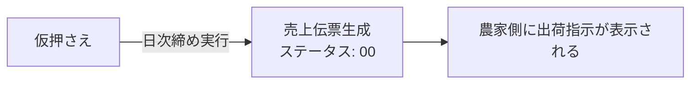

# 7. 受注データの取り込み（CSV）

## 7.1 基本操作

1. 「受注取込」画面を開く
2. 注文CSVファイルを選択してアップロード
3. 取込結果が画面に表示される

<!-- TODO: 画像挿入 — 受注取込画面 -->

## 7.2 UPSERT（アップサート）方式について

本システムの受注取込は**UPSERT方式**を採用しています。

| パターン | 動作 | 結果表示 |
|:---------|:-----|:---------|
| 新規の管理番号 | **新規登録**（INSERT） | `NEW` |
| 既存の管理番号 | **上書き更新**（UPDATE） | `UPD` |
| 確定済み（ステータス00以降） | **スキップ** | カウントされない |

> [!TIP]
> **ポイント**: 同じCSVを2回取り込んでもデータが増殖（二重登録）しません。2回目は「更新」として処理されます。

## 7.3 取込結果の確認

取込結果画面で以下の内訳を確認できます：

- **総件数**: 処理した全レコード数
- **新規（NEW）**: 新しく登録された件数
- **更新（UPD）**: 上書き更新された件数
- **エラー**: 処理できなかった件数

> [!WARNING]
> **⚠️ 注意**: 確定済みの伝票（ステータス `00` 以降）に対する更新はスキップされますが、スキップ件数は画面上に表示されません。取込前後の件数が合わない場合は、対象伝票のステータスをご確認ください。

---

# 8. 日次締め処理

## 8.1 日次締めとは

振り分けが完了した受注データに対して**売上伝票を生成**する処理です。

## 8.2 操作手順

1. 振り分けが完了していることを確認
2. 「日次締め」を実行
3. 対象の伝票のステータスが `00:確定` に変わる
4. 売上伝票が自動生成される

## 8.3 処理の流れ

> [!TIP]
> **ポイント**: 仮押さえを行わずに直接日次締めを実行した場合でも、システムが自動的に「仮押さえ → 日次締め」の順で処理を行います。

---

# 9. ヤマト出荷実績の取り込み

## 9.1 基本操作

1. 「出荷実績取込」画面を開く
2. ヤマト運輸から取得した出荷実績CSVを選択してアップロード
3. 取込結果が画面に表示される

<!-- TODO: 画像挿入 — 出荷実績取込画面 -->

## 9.2 マッチングの仕組み

- **管理番号（`kanri_no`）** をキーにして、受注データと出荷実績を紐付けます
- マッチングの結果に応じて、以下のステータスが自動で設定されます

| 結果 | ステータス | 説明 |
|:-----|:----------|:-----|
| 正常マッチ | `06:出荷完了` | ヤマト伝票番号が記録される |
| マッチ失敗・未確定 | `99:出荷異常(保留)` | エラーとして退避される |

## 9.3 正常系と異常系の混在

1つのCSV内に正常データと異常データが混在していても、**それぞれ個別に処理**されます。

- 正常なデータ → `06:出荷完了`
- 異常なデータ → `99:出荷異常(保留)`
- **全体がロールバックされることはありません**

## 9.4 取込結果の確認

- 取込結果画面で**総件数 / 新規 / 更新 / エラー**の内訳が表示されます
- 「エラーありのみ表示」フィルターで、保留データ（99）だけを絞り込めます

## 9.5 保留データ（99）の対応

1. 「エラーありのみ表示」で保留データを抽出
2. 詳細画面からエラー原因を確認
3. 必要に応じて、親の「受注画面」にジャンプして元データを修正
4. 修正後、再度CSVを取り込む

<!-- TODO: 画像挿入 — エラーデータの確認・修正フロー -->

---

# 10. 日次解除（キャンセル・やり直し）

## 10.1 日次解除とは

日次締めで生成された売上伝票を**取り消す（ロールバック）** 処理です。

## 10.2 操作手順

1. 対象の締め処理を選択
2. 「日次解除」を実行
3. 売上伝票が論理削除され、ステータスが仮押さえ状態に戻る

## 10.3 解除の影響範囲

| 対象 | 動作 |
|:-----|:-----|
| 売上伝票 | 論理削除（`del_flg=1`） |
| 仕入伝票 | 削除 |
| 農家側の出荷指示 | 消える（表示されなくなる） |
| 引当済み数量 | 自動再計算される |

## 10.4 出荷実績が記録済みの場合

> [!IMPORTANT]
> **⚠️ 重要**: 出荷完了（06）や出荷異常（99）のステータスが付いた伝票に対しても、日次解除は**実行可能**です。

ただし、解除後に元の状態に戻すには、**すべての処理を最初からトレースし直す**必要があります：

> [!NOTE]
> この仕様は、トラブル時に完全に切り戻せるようにするための安全設計です。通常運用では日次解除後に出荷実績の再取り込みが必要になることはありませんが、万が一の際はKSPまでご相談ください。
