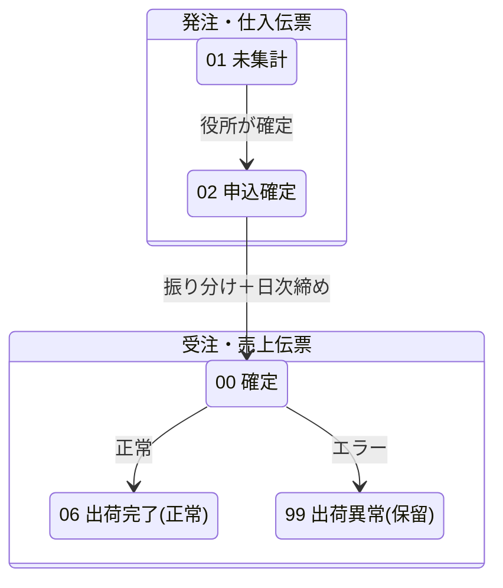
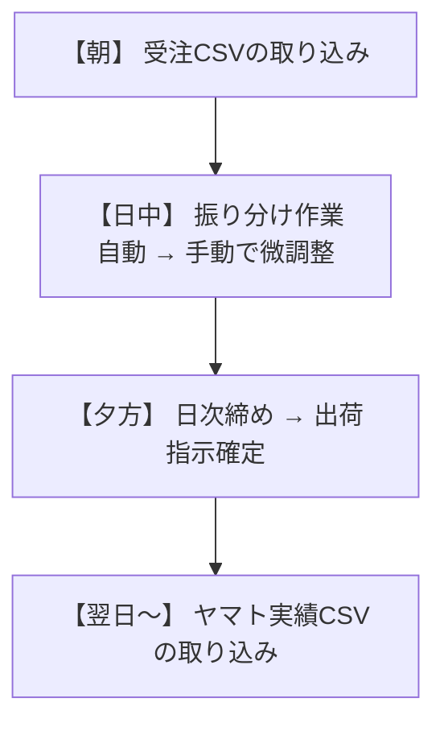

# 11. ステータス一覧と遷移ルール

## 11.1 ステータス一覧

| コード  | 名称       | 説明                 |
| :--: | :------- | :----------------- |
| `01` | 未集計      | 農家が入力中。編集可能        |
| `02` | 申込確定     | 役所が確定。10分間は農家も修正可能 |
| `00` | 確定       | 日次締め完了。売上伝票が生成済み   |
| `06` | 出荷完了     | 集荷実績取込完了（正常）       |
| `99` | 出荷異常(保留) | 集荷実績取込でエラー         |

## 11.2 遷移図

## 11.3 逆方向の遷移（解除・取消）

| 操作 | 遷移 |
|:-----|:-----|
| 申込確定の解除 | `02` → `01` |
| 仮押さえの取消 | 仮押さえ → 取消（再振り分け可能に） |
| 日次解除 | `00` → 仮押さえ状態に戻る |

---

# 12. イレギュラー対応ガイド

## 12.1 同じCSVを2回取り込んでしまった場合

**影響なし**。UPSERT方式のため、2回目は「更新（UPD）」として処理されます。データが二重になることはありません。

## 12.2 農家が10分経過後に操作してエラーが出た場合

**正常な動作です**。確定から10分経過後は自動ロックされます。エラー画面が表示されますが、データは保護されています。農家に対しては「確定後の修正はできません」と伝えてください。修正が必要な場合は、役所側でステータスを `01` に戻す対応が可能です。

## 12.3 複数の担当者が同時に同じデータを操作した場合

**後勝ち（Last Write Wins）方式**です。最後に保存した内容が反映されます。複数人で同じデータを同時に操作する場合は、事前に担当範囲を分けていただくことを推奨します。

## 12.4 振り分け時に供給量を超えてしまった場合

**システムがブロック**します。供給量を超える数量の振り分けは登録できません。

## 12.5 日次締め後に間違いに気づいた場合

1. **日次解除**を実行（売上伝票がロールバックされます）
2. 修正作業を行う
3. 再度日次締めを実行

> [!NOTE]
> 日次解除は何度でも実行可能ですが、出荷実績取込後に日次解除を行った場合は、全工程のやり直しが必要です。

## 12.6 配送実績CSVで一部だけエラーになった場合

正常なデータと異常なデータは**個別に処理**されます。正常分は `06:出荷完了` に、異常分は `99:出荷異常(保留)` になります。エラー分だけを修正して再取り込みしてください。

## 12.7 確定後に注文内容の変更依頼が来た場合

出荷指示確定後のデータ変更については、以下の手順で対応可能です：

1. 日次解除を実行
2. 受注データを修正
3. 再度日次締めを実行

**ただし、出荷実績取込後（ステータス06/99）の場合は全工程のやり直しが必要です。** 運用開始後、このようなケースが頻発する場合は、ワークフローの改善をKSPと協議してください。

---

# 13. 運用上の注意事項

## 13.1 環境について

> [!IMPORTANT]
> **⚠️ 重要**: 開発環境と本番環境はMirror構成のため、**どちらのURLからアクセスしても同じ本番データ**に反映されます。テスト用URLでの操作は控えてください。

## 13.2 日次運用の推奨フロー

## 13.3 データバックアップ

- システムでは論理削除（`del_flg`）を採用しています
- 削除操作を行っても、データは物理的には残っています
- 必要に応じて復元が可能です

## 13.4 トラブル発生時の連絡先

| 項目 | 連絡先 |
|:-----|:-------|
| システム障害・不具合 | KSP システム部 上野（kueno@k-sp.co.jp） |
| 電話 | 090-9277-9124 |
| 営業時間 | 平日 9:00〜18:00 |

---

# 14. よくある質問（FAQ）

### Q1. 農家がエラー画面を見て「壊れた」と連絡してきた

**A.** 確定から10分経過後の操作によるロックです。正常な動作であり、データは保護されています。農家に対して「確定後の修正期間（10分）を過ぎたため、変更できません」とご案内ください。修正が必要な場合は、役所側でステータスを `01:未集計` に戻すことで、農家が再入力できるようになります。

### Q2. CSVを取り込んだのに件数が合わない

**A.** すでに確定済み（ステータス `00` 以降）の伝票に対する更新はスキップされます。スキップされた件数は画面に表示されないため、取込前の伝票ステータスをご確認ください。

### Q3. 日次締めを2回実行してしまった

**A.** 問題ありません。すでに締め済みのデータは再処理の対象外となります。

### Q4. 振り分けの結果を全部やり直したい

**A.** 日次締め前であれば、仮押さえのキャンセル → 再振り分けで対応できます。日次締め後の場合は、日次解除 → 再振り分け → 再日次締めの手順で対応してください。

### Q5. テスト用のURLでうっかり操作してしまった

**A.** Mirror構成のため、本番データに反映されています。操作内容を確認の上、必要に応じて日次解除等で対処してください。不明な場合はKSPまでご連絡ください。
